# Egress Traffic Steering via Designated Egress Nodes

## 1. Overview

This solution steers egress traffic from configured Pod IPs or CIDRs through designated egress nodes — worker nodes labeled `k8s.ovn.org/egress-assignable=""`. Traffic is SNAT'd to the egress node's physical interface IP before leaving the cluster, rather than being SNAT'd to the local worker node's IP.

A bash reconciler script, deployed as a systemd service via MachineConfig, runs on every worker node. It self-determines whether the node is an egress node or a regular worker and configures nftables rules and policy routing accordingly. Egress node health is monitored via API status checks and direct ping probes, with automatic failover.

Only external application traffic from the configured Pod IPs/CIDRs is steered. All other traffic — DNS, logging, metrics, infrastructure pods, and return traffic from externally-initiated connections — exits normally via the local node.



## 2. Architecture

```
                    ┌─────────────────────┐
                    │   API Server        │
                    │  (node labels +     │
                    │   health status)    │
                    └────────┬────────────┘
                             │ queried every 10s
                             │
        ┌────────────────────┼────────────────────┐
        │                    │                    │
  ┌─────▼──────┐      ┌─────▼──────┐      ┌─────▼──────┐
  │  Worker-1   │      │  Worker-2   │      │  Egress-1   │
  │             │      │             │      │  (labeled)  │
  │ Target Pods │      │             │      │             │
  │             │      │             │      │ nftables:   │
  │ nftables:   │      │ nftables:   │      │ nft fwd:    │
  │ fwmark 0x2000      │ fwmark 0x2000      │ mark 0x3000 │
  │             │      │ (no match)  │      │             │
  │ OVN-K MASQ │      │             │      │ MASQUERADE  │
  │ policy route│      │             │      │             │
  │ table 100   │      │             │      │             │
  └──────┬──────┘      └─────────────┘      └──────┬──────┘
         │                                         │
         │         steered via IP routing           │
         └─────────────────────────────────────────►│
                                                    │ SNAT to
                                                    │ egress node IP
                                                    ▼
                                              ┌───────────┐
                                              │ External  │
                                              │ Network   │
                                              └───────────┘
```

### Components

- **Configuration file** (`egress-steering.conf`): defines which Pod IPs/CIDRs to steer, cluster CIDRs, and tuning parameters. Deployed to `/etc/egress-steering/egress-steering.conf`.
- **Reconciler script** (`egress-steering-reconciler.sh`): bash script running as a systemd service on every worker node. Sources the config file, queries the API for egress node labels and health, then configures local nftables and routing.
- **MachineConfig** (`machineconfig-egress-steering.yaml`): deploys the script, config file, and systemd unit to all nodes in the worker MachineConfigPool.
- **nftables**: marks egress-bound packets on worker nodes; marks and MASQUERADEs forwarded traffic on egress nodes.
- **Policy routing**: steers marked packets to egress nodes via a dedicated routing table.
- **OVN-K MASQUERADE**: on worker nodes, OVN-K's existing `ovn-kube-pod-subnet-masq` SNATs the Pod source IP to the worker node IP before the packet reaches the egress node. The return path uses this conntrack entry to un-SNAT back to the Pod IP.

## 3. Packet Flow

### Pod-initiated egress traffic (steered)

```
1. Target Pod sends packet to 8.8.8.8
2. Packet enters host network stack via OVN (routingViaHost: true)
3. Worker nftables PREROUTING (mangle):
   - src matches POD_CIDRS
   - dst=8.8.8.8 (not in cluster CIDRs)
   - ct direction = original (Pod initiated this connection)
   → meta mark set 0x2000
4. Worker routing decision:
   - fwmark 0x2000 → lookup table 100
   - table 100: default via <egress-node-IP> (ECMP if multiple)
5. Worker POSTROUTING:
   - OVN-K's ovn-kube-pod-subnet-masq MASQUERADE fires
   → src becomes worker node IP (e.g., 10.6.105.228)
6. Packet forwarded to egress node over physical network (L2)
7. Egress node nftables FORWARD (filter - 1):
   - dst not in CLUSTER_CIDRS → mark set 0x3000
8. Egress node POSTROUTING:
   - mark 0x3000 → MASQUERADE (src becomes egress node IP)
9. Packet exits to external network
```

### Return traffic for Pod-initiated egress

```
1. External host replies to egress node IP
2. Egress node conntrack un-SNATs: dst → worker node IP
3. Egress node forwards to worker via physical network (same L2)
4. Worker receives reply on physical interface
5. Worker conntrack un-SNATs: dst → original Pod IP
6. Worker delivers to Pod via OVN
```

### Externally-initiated ingress traffic (untouched)

```
1. External client connects to Pod via NodePort/LoadBalancer
2. Connection tracked: original direction = External → Pod
3. Pod replies: src=Pod IP, dst=external
4. Worker nftables PREROUTING:
   - src matches POD_CIDRS
   - dst=external (not in cluster CIDRs)
   - ct direction = reply (external initiated this connection)
   → NO mark applied
5. Normal routing → exits via local node (standard SNAT)
```

## 4. Prerequisites

- **OVN-Kubernetes with `routingViaHost: true` and `ipForwarding: Global`**: the solution intercepts Pod egress traffic in the host network stack, which requires routing via host. `ipForwarding: Global` enables IP forwarding, sets loose-mode `rp_filter`, and changes the FORWARD chain policy to `accept` on all nodes — removing the need to insert rules into OVN-K's iptables-nft managed chains. Enable with:
  ```bash
  oc apply -f network-operator-patch.yaml
  ```
  This triggers a rolling restart of OVN-Kubernetes pods on all nodes. Wait for the rollout:
  ```bash
  oc rollout status daemonset/ovnkube-node -n openshift-ovn-kubernetes --timeout=300s
  ```
- **Node label**: at least one worker node must be labeled `k8s.ovn.org/egress-assignable=""`.
- **L2 adjacency**: worker nodes and egress nodes must be on the same L2 network (no tunnels are used between them).
- **RHCOS / Fedora CoreOS**: the MachineConfig targets OpenShift worker nodes running RHCOS.
- **Tools on nodes**: `oc`, `jq`, `nft`, `ping`, `ip`, `sysctl` must be available on the nodes.
- **API access**: a ServiceAccount with node-list permissions, its token and the API server CA certificate deployed to the nodes (see Deployment).

## 5. Configuration

All configuration lives in `/etc/egress-steering/egress-steering.conf` (source file: `egress-steering.conf`). The reconciler script sources this file at startup.

| Variable | Default | Description |
|----------|---------|-------------|
| `POD_CIDRS` | `10.132.0.0/14` | Pod IPs or CIDRs to steer (nftables set syntax) |
| `CLUSTER_CIDRS` | `10.132.0.0/14, 172.30.0.0/16, 10.6.105.0/24, 169.254.169.0/29` | Destinations excluded from steering (Pod, Service, Machine, link-local CIDRs) |
| `API_SERVER` | `https://api-int.example.com:6443` | API server URL |
| `CA_FILE` | `/etc/egress-steering/ca.crt` | Path to the API server CA certificate |
| `TOKEN_FILE` | `/etc/egress-steering/token` | Path to the ServiceAccount token file |
| `POD_CIDRS_V6` | *(empty)* | IPv6 Pod CIDRs to steer (optional, nftables set syntax) |
| `CLUSTER_CIDRS_V6` | *(empty)* | IPv6 cluster-internal CIDRs excluded from steering (required if `POD_CIDRS_V6` is set) |
| `FWMARK` | `0x2000` | Packet mark for policy routing (must not conflict with other fwmarks) |
| `RT_TABLE` | `100` | Routing table number for steered traffic |
| `RT_PRIO` | `1000` | Priority of the ip rule |
| `RECONCILE_INTERVAL` | `10` | Seconds between reconciliation cycles |
| `PING_TIMEOUT` | `2` | Seconds to wait for ping reply from egress node |
| `FIB_MULTIPATH_HASH_POLICY` | `1` | ECMP hash policy: `0` = L3 only, `1` = L4 (includes ports) |
| `NFT_TABLE_WORKER` | `egress-steering` | nftables table name on worker nodes |
| `NFT_TABLE_EGRESS` | `egress-snat` | nftables table name on egress nodes |

### POD_CIDRS examples

```bash
# Full cluster Pod CIDR
POD_CIDRS="10.132.0.0/14"

# Single IP
POD_CIDRS="10.132.2.29"

# Multiple IPs
POD_CIDRS="{ 10.132.2.29, 10.132.2.30 }"

# Multiple CIDRs
POD_CIDRS="{ 10.132.2.0/24, 10.132.3.0/24 }"

# Mixed IPs and CIDRs
POD_CIDRS="{ 10.132.2.29, 10.132.3.0/24 }"
```

Update `CLUSTER_CIDRS` to match your cluster's Pod, Service, and Machine network CIDRs.

## 6. Deployment

### Step 1: Export kubeconfig

```bash
export KUBECONFIG=/path/to/kubeconfig
```

### Step 2: Label egress nodes

```bash
oc label node <node-name> k8s.ovn.org/egress-assignable=""
```

### Step 3: Create ServiceAccount and extract credentials

```bash
./setup-serviceaccount.sh create -o /tmp/egress-steering-creds
```

This creates the ServiceAccount, ClusterRole, ClusterRoleBinding, and token Secret, then extracts the API server URL and CA certificate from the kubeconfig and the token from the Secret. `API_SERVER` in `egress-steering.conf` is auto-populated from the exported kubeconfig.

### Step 4: Edit the configuration

Edit `egress-steering.conf` to set `POD_CIDRS` and `CLUSTER_CIDRS` for your environment.

### Step 5: Generate the final MachineConfig

```bash
./generate-machineconfig.sh \
  -a /tmp/egress-steering-creds/ca.crt \
  -k /tmp/egress-steering-creds/token
```

This base64-encodes the script, config, CA certificate, and token into the MachineConfig template, producing `machineconfig-egress-steering-final.yaml`.

Options:

```bash
./generate-machineconfig.sh -h              # show usage
./generate-machineconfig.sh -c my.conf ...  # use a custom config file
./generate-machineconfig.sh -o output.yaml ... # custom output path
```

### Step 6: Apply the node disruption policy (optional, recommended)

By default, any MachineConfig change triggers a node reboot. Apply the `MachineConfiguration` patch to restart the `egress-steering` service instead of rebooting when the script, config, CA, or token files change:

```bash
oc apply -f machineconfiguration-patch.yaml
```

This only needs to be applied once. Subsequent MachineConfig updates to the egress-steering files will restart the service without rebooting.

### Step 7: Apply the MachineConfig

```bash
oc apply -f machineconfig-egress-steering-final.yaml
```

If the node disruption policy was applied in step 6, nodes will restart the `egress-steering` service without rebooting. Otherwise, this triggers a rolling reboot. Monitor progress:

```bash
oc get mcp worker -w
```

### Step 8: Verify

After all nodes are updated and running:

```bash
# On a worker node hosting target Pods:
oc debug node/<worker-node> -- chroot /host journalctl -u egress-steering -f

# Check nftables rules:
oc debug node/<worker-node> -- chroot /host nft list table inet egress-steering

# Check policy routing:
oc debug node/<worker-node> -- chroot /host ip rule show
oc debug node/<worker-node> -- chroot /host ip route show table 100
```

### Step 9: Run E2E tests (optional)

```bash
./test-e2e.sh
```

The test script runs the following phases:

**Preflight** — aborts early if any prerequisite is missing (`routingViaHost`, `ipForwarding: Global`, egress node labels, worker nodes, API access).

**Setup** — creates a temporary namespace (`egress-steering-test`) and a test pod. Cleanup is registered via `trap` so the namespace is always deleted on exit.

**Tests:**

| Test | What it checks |
|---|---|
| `test_service_running` | `systemctl is-active egress-steering` on every worker node |
| `test_worker_nftables` | `inet egress-steering` table has a prerouting mark rule and routing table 100 has a default route. If the pod landed on an egress node, checks an alternate non-egress worker instead. |
| `test_egress_nftables` | `inet egress-snat` table has a masquerade rule on every labeled egress node |
| `test_external_connectivity` | `curl` from the pod to `1.1.1.1:80` returns a non-zero HTTP status code |
| `test_traffic_steered` | After curling, checks the worker's conntrack for a replied entry for `1.1.1.1`, confirming traffic went through the host stack and was policy-routed. Skips if the pod is on an egress node. |
| `test_cluster_dns` | `getent hosts kubernetes.default.svc.cluster.local` resolves, confirming DNS traffic is not steered |
| `test_node_connectivity` | `curl` to the kubelet on the node's InternalIP returns 200/401/403, confirming machine network traffic is not steered |
| `test_cluster_internal` | `curl` to the cluster API returns 200/401/403, confirming cluster-internal traffic is not steered |

Exits with code 1 if any test failed, 0 if all passed.

## 7. Health Detection and Failover

The reconciler detects egress node failures through two layers:

### Layer 1: API health status

`oc get nodes` returns node conditions. Nodes with `Ready != True` are excluded from the egress node candidate list. This catches:
- Node crashes / kubelet failures
- Node drain / cordon operations

Detection time depends on the kubelet's node-monitor grace period (default ~5 minutes in OpenShift).

### Layer 2: Direct ping probe

Each worker pings all candidate egress nodes in parallel before selecting one. Nodes that don't respond within `PING_TIMEOUT` (default 2s) are excluded. This catches:
- Network partitions
- Interface failures
- Cases where the node is responsive to the API server but unreachable from this worker

### Failover behavior

- **Worst-case detection time**: ~12 seconds (10s reconcile interval + 2s ping timeout)
- **On failover**: the ECMP route is rebuilt without the failed node. Flows previously hashed to the failed node will break (conntrack entries are on the failed node). Flows to remaining egress nodes are unaffected.
- **API unreachable**: if the API server itself is down, the reconciler keeps the current rules in place rather than tearing them down. This prevents unnecessary disruption during control plane outages.
- **All egress nodes unreachable**: the route is replaced with an `unreachable` route so steered traffic is dropped rather than falling back to normal local-node routing. The nftables marking rules and ip rule remain in place. Traffic resumes when an egress node becomes available again.

## 8. ECMP Load Distribution

When multiple egress nodes are healthy, the reconciler creates an ECMP (Equal-Cost Multi-Path) route:

```
default
  nexthop via 10.0.0.10 weight 1
  nexthop via 10.0.0.11 weight 1
  table 100
```

The kernel distributes flows across nexthops using a hash of the packet's 5-tuple (`src IP, dst IP, protocol, src port, dst port`). The `fib_multipath_hash_policy=1` sysctl is set to enable L4 hashing, ensuring that flows to the same destination IP but different ports can be spread across egress nodes.

### Implications

- The same flow always goes to the same egress node (consistent hashing).
- Multiple SNAT IPs are in play — if destination-side firewalls restrict by source IP, all egress node IPs must be allowed.
- If an egress node is removed from the ECMP route, only flows that were hashed to it are disrupted.

## 9. Scope and Exclusions

### Traffic that IS steered

- Packets from IPs/CIDRs matching `POD_CIDRS` to destinations outside `CLUSTER_CIDRS`, where the connection was initiated by the Pod (`ct direction original`).

### Traffic that is NOT steered

| Traffic type | Why excluded |
|---|---|
| Cluster-internal (Pod-to-Pod, Pod-to-Service) | Destination in `10.132.0.0/14` or `172.30.0.0/16` |
| Pod-to-Node (machine network) | Destination in `10.6.105.0/24` |
| DNS to cluster CoreDNS | Service IP `172.30.0.10` is in `172.30.0.0/16` |
| Link-local / metadata | Destination in `169.254.169.0/29` |
| Return traffic for externally-initiated connections | `ct direction reply` — nftables rule does not match |
| Traffic from Pods not matching `POD_CIDRS` | Source IP does not match configured CIDRs |

## 10. Troubleshooting

### Verify the reconciler is running

```bash
oc debug node/<node> -- chroot /host systemctl status egress-steering
oc debug node/<node> -- chroot /host journalctl -u egress-steering --no-pager -n 50
```

### Check the active configuration

```bash
oc debug node/<node> -- chroot /host cat /etc/egress-steering/egress-steering.conf
```

### Check nftables rules on a worker node

```bash
oc debug node/<node> -- chroot /host nft list table inet egress-steering
```

Expected output:

```
table inet egress-steering {
  chain prerouting {
    type filter hook prerouting priority mangle; policy accept;
    ip saddr 10.132.0.0/14 ip daddr != { 10.132.0.0/14, 172.30.0.0/16, 10.6.105.0/24, 169.254.169.0/29 } ct direction original meta mark set 0x00002000
  }
}
```

### Check nftables rules on an egress node

```bash
oc debug node/<egress-node> -- chroot /host nft list table inet egress-snat
```

Expected output:

```
table inet egress-snat {
  chain forward {
    type filter hook forward priority filter - 1; policy accept;
    ip daddr != { 10.132.0.0/14, 172.30.0.0/16, 10.6.105.0/24, 169.254.169.0/29 } meta mark set 0x00003000
  }
  chain postrouting {
    type nat hook postrouting priority srcnat; policy accept;
    meta mark 0x00003000 masquerade
  }
}
```

### Check policy routing on a worker node

```bash
# ip rules:
oc debug node/<node> -- chroot /host ip rule show
# Look for: 1000: from all fwmark 0x2000 lookup 100

# Routing table:
oc debug node/<node> -- chroot /host ip route show table 100
# Look for: default nexthop via <egress-IP> weight 1 ...
```

### Verify traffic is being steered

From the worker node hosting target Pods:

```bash
# Watch marked packets:
oc debug node/<node> -- chroot /host nft list ruleset -a
# Or use counters — add a counter to the nftables rule temporarily

# Check conntrack entries:
oc debug node/<node> -- chroot /host conntrack -L -s <pod-ip>
```

From the egress node:

```bash
# Watch SNAT'd traffic:
oc debug node/<egress-node> -- chroot /host conntrack -L -s <pod-ip>
```

### Common issues

| Symptom | Likely cause | Fix |
|---------|-------------|-----|
| Reconciler exits with "configuration file not found" | Config file not deployed | Verify `/etc/egress-steering/egress-steering.conf` exists |
| Reconciler exits with "cannot reach API" | Token expired, CA missing, or wrong API_SERVER | Verify `/etc/egress-steering/token` and `/etc/egress-steering/ca.crt` exist; check `API_SERVER` in config |
| Reconciler exits with "cannot determine node name" | Node InternalIP mismatch | Check `ip route get 1.1.1.1` returns the correct node IP |
| nftables counter at 0 on worker | `routingViaHost` not enabled | Verify `oc get network.operator cluster -o jsonpath='{.spec.defaultNetwork.ovnKubernetesConfig.gatewayConfig.routingViaHost}'` returns `true` |
| Traffic not steered | Pod not on this node / wrong Pod CIDR | Verify `POD_CIDRS` in config and that the Pod is scheduled on a node with the nftables rule |
| Traffic black-holed | Egress node not forwarding | Check `ip_forward=1` and `rp_filter=2` on egress node |
| Traffic marked but timing out | FORWARD policy is DROP | Verify `ipForwarding: Global` is set: `nft list chain ip filter FORWARD` should show `policy accept` |
| Return traffic not reaching worker | Egress node not forwarding return traffic | Check `ip_forward=1` on egress node, verify `ipForwarding: Global` |

## 11. Cleanup and Removal

### Remove the MachineConfig

```bash
oc delete machineconfig 99-egress-steering
```

This removes the script, config, token, CA, and systemd unit. With the node disruption policy, this restarts the service; without it, nodes will reboot.

### Remove the ServiceAccount and RBAC

```bash
./setup-serviceaccount.sh delete
```

### Manual cleanup (without reboot)

On each node:

```bash
# Stop the service
systemctl stop egress-steering

# Run explicit cleanup
/usr/local/bin/egress-steering-reconciler.sh cleanup

# Disable the service
systemctl disable egress-steering
```

The cleanup subcommand removes:
- nftables tables (`egress-steering` and `egress-snat`)
- Policy routing rule (fwmark `0x2000` → table `100`)
- Routes in table `100`

## 12. Limitations and Caveats

- **Requires `routingViaHost: true` and `ipForwarding: Global`**: the solution intercepts traffic in the host network stack (`routingViaHost`) and requires permissive forwarding (`ipForwarding: Global`) so steered traffic isn't dropped by OVN-K's FORWARD chain. Without these, OVN handles egress routing entirely within OVS or drops forwarded packets.
- **Double SNAT**: traffic is SNATed twice — first by OVN-K on the worker (Pod IP → Worker IP), then by the egress node (Worker IP → Egress IP). The return path reverses both. This means the external destination sees the egress node's IP, but conntrack entries exist on both the worker and egress node.
- **L2 adjacency required**: worker nodes and egress nodes must be on the same L2 segment. If they are not, a tunnel-based approach (VXLAN or GRE) is needed instead of direct IP routing.
- **Pod IP stability**: if target Pods are rescheduled and receive new IPs, the configuration must be updated. Use CIDR ranges in `POD_CIDRS` for more stable targeting.
- **Conntrack on both nodes**: SNAT conntrack entries exist on both the worker (Pod IP ↔ Worker IP) and the egress node (Worker IP ↔ Egress IP). If the egress node fails, all connections through it break regardless of the failover strategy.
- **MachineConfig triggers reboots by default**: without the `MachineConfiguration` node disruption policy patch, applying or removing the MachineConfig causes a rolling reboot. Apply `machineconfiguration-patch.yaml` to restart the service instead of rebooting when the script, config, CA, or token files change.
- **Configuration changes require MachineConfig update**: since the config file is deployed via MachineConfig, changing `POD_CIDRS` requires updating and re-applying the MachineConfig. With the node disruption policy, this restarts the service without rebooting. Alternatively, edit the config file directly on each node and restart the service — but this change will not persist across MachineConfig re-application.
- **Single reconciler per node**: the systemd service runs one instance per node. There is no cross-node coordination — each node independently determines its role and selects the same active egress node(s) because the selection is deterministic (sorted by name, filtered by health).
- **IPv6 support is optional**: set `POD_CIDRS_V6` and `CLUSTER_CIDRS_V6` to enable IPv6 steering. Both IPv4 and IPv6 rules coexist in the same `inet` family nftables table. IPv6 policy routing requires egress nodes with IPv6 InternalIP addresses.
